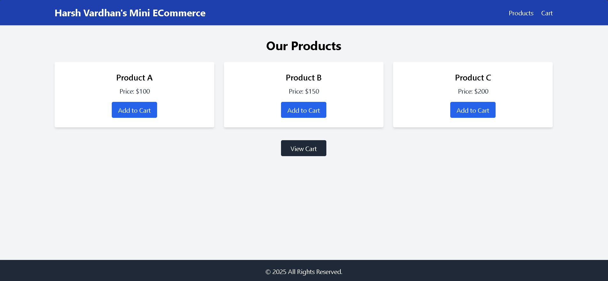
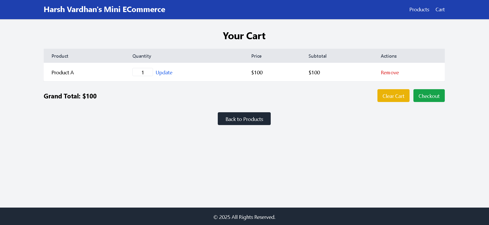
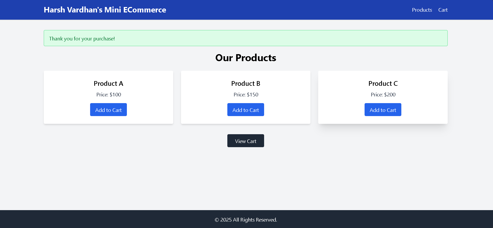

<p align="center">
    <a href="https://laravel.com" target="_blank">
        
    </a>
</p>

<p align="center">
    <a href="https://github.com/laravel/framework/actions"></a>
    <a href="https://packagist.org/packages/laravel/framework"></a>
    <a href="https://packagist.org/packages/laravel/framework"></a>
    <a href="https://packagist.org/packages/laravel/framework"></a>
</p>

---

# 🛒 Mini ECommerce Cart in Laravel

A minimalist Laravel-based ECommerce Cart application utilizing **Laravel Sessions** to manage cart functionalities like Add to Cart, Update Quantity, Remove Items, Clear Cart, and Checkout Simulation. Designed for beginners learning **Laravel CRUD operations** and **Session Management**.

---

## 🚀 Features
- Product Listing with Add to Cart functionality.
- View Cart with Product Quantity, Price, Subtotal, and Grand Total.
- Update Product Quantity directly in Cart.
- Remove Single Product from Cart.
- Clear Entire Cart.
- Session-based Cart Storage (No Database Storage for Products).
- Responsive Design using TailwindCSS.
- Flash Messages for Add/Remove/Checkout actions.

---

## 🖼️ Screenshots

### 🛍️ Product Listing Page


---

### ➕ Product Added to Cart


---

### 🛒 View Cart with Items


---

### ✅ Checkout Confirmation


---

### 🗑️ Cart Cleared Message


---

## 📦 Installation Steps

```bash
git clone https://github.com/YourUsername/Ecommerce-Cart.git
cd Ecommerce-Cart
composer install
cp .env.example .env
php artisan key:generate
php artisan serve
